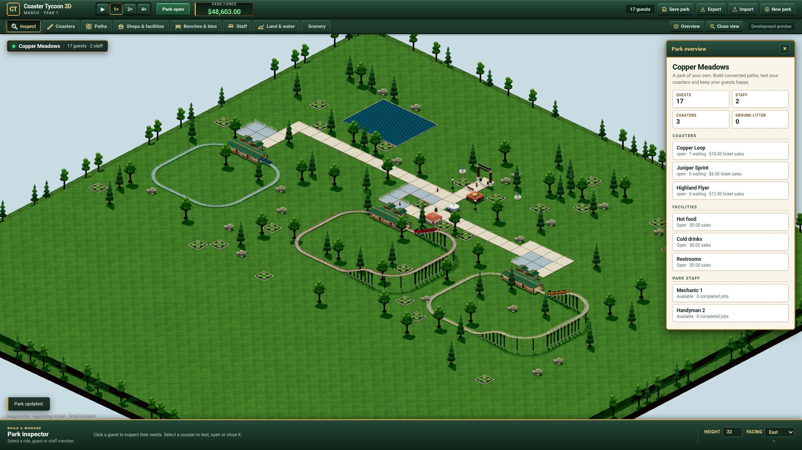

# Coaster Tycoon 3D

An independently implemented browser-based 3D theme park management game,
using RollerCoaster Tycoon 2 as its gameplay reference. The project is
unaffiliated with RollerCoaster Tycoon 2 and OpenRCT2.

Project code is licensed under [MIT](LICENSE). The implementation and required
game resources are independent; see the [source strategy decision](docs/adr/0001-independent-mit-implementation.md).

Try the [Classic showcase](https://patrick-fu.github.io/coaster-tycoon-3d/previews/classic-a7d6451/?showcase=classic)
in desktop Chrome or Edge. Its three operating steel-coaster layouts, shops,
gardens and local save use a separate showcase slot, preserving your existing
park at the [regular preview](https://patrick-fu.github.io/coaster-tycoon-3d/).
Build and manage Copper Meadows with mouse/keyboard;
drag to orbit, right-drag to pan and scroll to zoom. Space pauses the park.
Saves remain in this browser; Export/Import moves a park between devices.

This checkpoint has procedural materials and composed models, three steel-coaster
layouts, three generic facilities and six buildable scenery types with real
construction, money, clearance and saves. Patrick rejected its visual quality;
it is retained as a measured baseline, not the accepted art direction. See
[verification evidence](docs/verification/classic-art/README.md).

The earlier first-playable planning established the architecture. The production
simulation kernel implements atomic
construction commands, candidate train motion, individual guests/queues/seats,
food/drink/restroom purchases, benches/bins, staff services and categorized
operating finance with validated save continuation. See its [interface and verification boundary](docs/simulation-kernel.md).
Patrick accepted the scope, independent architecture, Classic controls and
[acceptance contract](docs/first-playable-acceptance.md). The [Classic development preview](docs/classic-browser.md) integrates construction
and management with the production simulation. It is not yet an accepted first
playable; original fidelity, scale/soak and real integrated-GPU gates remain open.
Prototype evidence is kept separate from production checks.

The first playable scope is a money-enabled sandbox integrating custom coaster
construction, individual guest simulation and park management at original-game
scale. The selected [browser architecture](docs/adr/0002-client-side-simulation-and-rendering.md)
uses an independent TypeScript simulation in a Web Worker, Three.js rendering
and project-owned local saves. Patrick selected the Classic interaction layout
on 2026-10-05: a horizontal command desk and a bottom construction palette,
with precise endpoint construction and contextual inspection. The disposable
[construction prototype](https://github.com/patrick-fu/coaster-tycoon-3d/tree/p/patrick/prototype/park-construction/prototypes/park-construction)
is retained outside main. Layout selection does not certify every interaction
or gameplay parity; measured capacity and final acceptance still require
experiments and live feedback. Patrick chose to proceed on 2026-10-05 while
keeping real integrated-GPU qualification as a mandatory first-playable gate.
The remote synthetic experiment informs implementation; it does not lower the
original-scale or frame-rate goals. The concrete
[acceptance contract](docs/first-playable-acceptance.md) defines the production
checks and human review required before completion.

Current work: [Plan the complete RCT2 catalogue and detailed 3D production programme](https://github.com/patrick-fu/coaster-tycoon-3d/issues/27).
The [programme](docs/planning/rct2-program.md) covers all original ride categories,
physics/operation, products/services, guests/staff, admission/finance, research,
scenarios and authored presets. Its [source-linked inventory](docs/research/rct2-program/README.md)
distinguishes original families, variants, expansions and modern additions. A
[dedicated editable model pipeline](docs/planning/model-pipeline.md) and corrected
[Classic frontend contract](docs/planning/classic-content-ui.md) precede bulk
implementation. Twelve hashed CC0 material source bundles were acquired; actual
model export, original comparisons and visual acceptance remain separate gates.

[Qualify the Classic first playable against original RCT2 and representative hardware](https://github.com/patrick-fu/coaster-tycoon-3d/issues/24)
remains open for its original fidelity, scale and representative-hardware gates.

Retained planning map: [Define the first playable version of a faithful 3D RCT2 browser game](https://github.com/patrick-fu/coaster-tycoon-3d/issues/1). Its sub-issues and dependencies show the current decision frontier.
