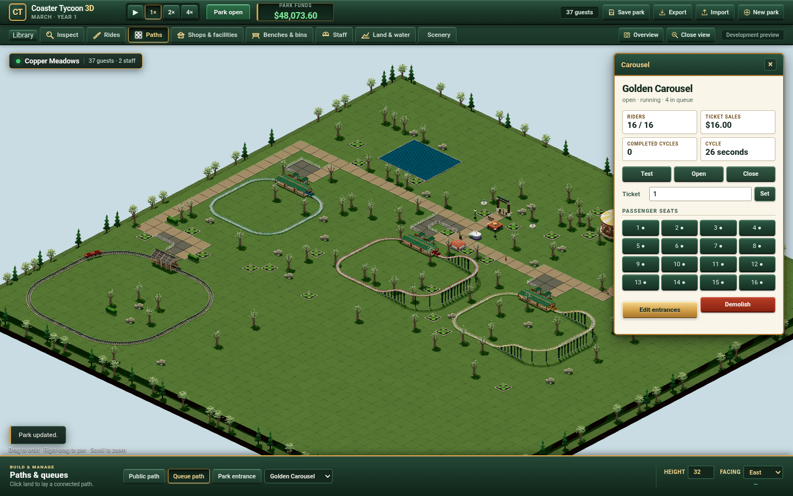

# Coaster Tycoon 3D

An independently implemented browser-based 3D theme park management game,
using RollerCoaster Tycoon 2 as its gameplay reference. The project is
unaffiliated with RollerCoaster Tycoon 2 and OpenRCT2.

Project code is licensed under [MIT](LICENSE). The implementation and required
game resources are independent; see the [source strategy decision](docs/adr/0001-independent-mit-implementation.md).

Try the [current Classic showcase](https://patrick-fu.github.io/coaster-tycoon-3d/?showcase=classic)
in desktop Chrome or Edge. Its three steel layouts, detailed wooden coaster and
sixteen-seat Carousel, shops,
gardens and local save use a separate showcase slot, preserving your existing
park at the [regular preview](https://patrick-fu.github.io/coaster-tycoon-3d/).
Build and manage Copper Meadows with mouse/keyboard;
drag to orbit, right-drag to pan and scroll to zoom. Space pauses the park.
Saves remain in this browser. Export/Import provides file backups;
cross-runtime default-rule portability is not yet qualified.
An earlier local park remains intact; choose **New park** after saving/exporting
it to start the current five-ride layout.

The current art iteration adds detailed oak meshes, real CC0 bark and leaf
surfaces, masked shadows and three camera-selected levels of detail to the
playable park. Planting, inspection, demolition and save/load use the existing
simulation. See the [editable asset source](prototypes/organic-tree/README.md)
and [verification evidence](docs/verification/oak-scenery/README.md). The modeless
Classic Library exposes the full reference catalogue and independently implemented
candidate variants; unavailable reference items remain clearly marked.

The [mixed coaster slice](docs/mixed-coasters.md) adds an independently authored
four-seat wooden car, articulated bogies and restraints, a real drawbar, timber
station and textured track. Cedar Timber Run operates beside the steel rides:
actual guests board, pay, ride and unload, and their ordered seats survive saving.
The finite wooden construction profile supports ground-level flat track and
R16 curves, with two cars at most. This is a project candidate, not the original
Wooden/PTCT1 entry. The published Carousel snapshot uses v10/content3; historical steel continuation
and [the measured checks](docs/verification/mixed-wooden/README.md) have distinct
evidence boundaries.

Golden Carousel adds a separately authored fixed3×3 ride, a sculpted sixteen-horse
body, connected timber entrances and real paid passengers. Its own session
handles finite load waits, timed rotation, closure, breakdown, blocked exits,
mechanic work and safe demolition. [Actual checks and images](docs/verification/carousel/README.md)
and [the verified frozen preview](https://patrick-fu.github.io/coaster-tycoon-3d/previews/carousel-5498c35/?showcase=classic)
retain prior steel/wood state and pose continuations. The independent Carousel
is distinct from the unavailable original MGR1 reference; original timing and
visual agreement remain unqualified. Existing v9 saves migrate without replacing
their park layout, and previous browser slots remain intact.

The Log Flume source adds an independent four-seat log boat, textured channel,
timber supports, a covered station and connected entrance/exit stairs. Build
it from **Library → Water rides → Log Flume**, complete the closed lift/drop/
splash circuit and its empty Test, then Open it for real paid guests. Successful
test results remain available until an explicit new Test. Fresh parks retain
the five-ride layout; this ride is available for construction. This source uses
save11/content4/protocol4 and validates older parks before adding declared
fields. [Finite checks and actual paid image](docs/verification/log-flume/README.md)
record 238 kernel checks and seven current production-worker paid controls.
The public Flume preview is recorded separately after distribution checks;
original LFB1 agreement and Patrick's visual/play acceptance remain open.

The [earlier art checkpoint](https://patrick-fu.github.io/coaster-tycoon-3d/previews/classic-a7d6451/?showcase=classic)
has procedural materials and composed models, three steel-coaster
layouts, three generic facilities and six buildable scenery types with real
construction, money, clearance and saves. Patrick rejected its visual quality;
it is retained as a measured baseline, not the accepted art direction. The
current iteration still requires Patrick's visual acceptance. See
[verification evidence](docs/verification/classic-art/README.md).

The earlier first-playable planning established the architecture. The production
simulation kernel implements atomic
construction commands, candidate train motion, individual guests/queues/seats,
food/drink/restroom purchases, benches/bins, staff services and categorized
operating finance with validated save continuation. See its [interface and verification boundary](docs/simulation-kernel.md).
Patrick accepted the scope, independent architecture, Classic controls and
[acceptance contract](docs/first-playable-acceptance.md). The [Classic development preview](docs/classic-browser.md) integrates construction
and management with the production simulation. It is not yet an accepted first
playable; original fidelity, scale/soak and real integrated-GPU gates remain open.
Prototype evidence is kept separate from production checks.

The first playable scope is a money-enabled sandbox integrating custom coaster
construction, individual guest simulation and park management at original-game
scale. The selected [browser architecture](docs/adr/0002-client-side-simulation-and-rendering.md)
uses an independent TypeScript simulation in a Web Worker, Three.js rendering
and project-owned local saves. Patrick selected the Classic interaction layout
on 2026-10-05: a horizontal command desk and a bottom construction palette,
with precise endpoint construction and contextual inspection. The disposable
[construction prototype](https://github.com/patrick-fu/coaster-tycoon-3d/tree/p/patrick/prototype/park-construction/prototypes/park-construction)
is retained outside main. Layout selection does not certify every interaction
or gameplay parity; measured capacity and final acceptance still require
experiments and live feedback. Patrick chose to proceed on 2026-10-05 while
keeping real integrated-GPU qualification as a mandatory first-playable gate.
The remote synthetic experiment informs implementation; it does not lower the
original-scale or frame-rate goals. The concrete
[acceptance contract](docs/first-playable-acceptance.md) defines the production
checks and human review required before completion.

Current work: [Plan the complete RCT2 catalogue and detailed 3D production programme](https://github.com/patrick-fu/coaster-tycoon-3d/issues/27).
The Classic park now uses [acquired CC0 lawn and paving maps](docs/experiments/classic-surfaces/README.md)
with owned loading/cancellation/disposal and unchanged native geometry. The
[finite wooden-car inspector](https://patrick-fu.github.io/coaster-tycoon-3d/previews/wooden-hitch/)
retains the earlier qualified car/link experiment. The playable park uses its
separately integrated and revised assets.
The [programme](docs/planning/rct2-program.md) covers all original ride categories,
physics/operation, products/services, guests/staff, admission/finance, research,
scenarios and authored presets. Its [source-linked inventory](docs/research/rct2-program/README.md)
distinguishes original families, variants, expansions and modern additions. A
[dedicated editable model pipeline](docs/planning/model-pipeline.md) and corrected
[Classic frontend contract](docs/planning/classic-content-ui.md) precede bulk
implementation. Twelve hashed CC0 material source bundles were acquired; actual
model export, original comparisons and visual acceptance remain separate gates.

The [Model Workshop](https://patrick-fu.github.io/coaster-tycoon-3d/previews/model-workshop/)
provides actual editable wooden-car, timber-station and information-kiosk
samples from the dedicated Blender/GLB route. See the
[laboratory source and verification boundaries](prototypes/detailed-assets/README.md).
The samples precede bulk art production and do not add those rides/services to
the playable park. Original comparisons and Patrick's visual acceptance remain
open.

The [finite wooden joint experiment](docs/experiments/wooden-hitch/README.md)
now qualifies replacement mounts and a real drawbar at 59 frozen flat poses,
preserving the original car's UVs, bitmap resources, seats and bogie frames.
This clears the measured hardware interference for that frozen fixture. The
current mixed park has a separately verified finite operation/placement contract;
the inspector's fixture is not replayed as its train motion.

[Qualify the Classic first playable against original RCT2 and representative hardware](https://github.com/patrick-fu/coaster-tycoon-3d/issues/24)
remains open for its original fidelity, scale and representative-hardware gates.

Retained planning map: [Define the first playable version of a faithful 3D RCT2 browser game](https://github.com/patrick-fu/coaster-tycoon-3d/issues/1). Its sub-issues and dependencies show the current decision frontier.
