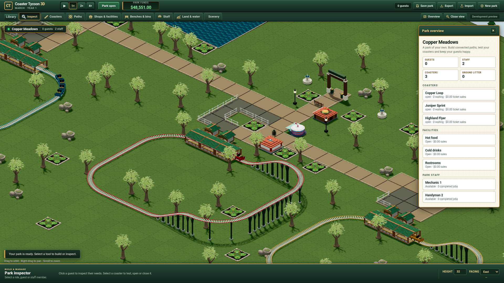

# Acquired lawn and paving inside Classic

The existing playable park now uses six actual ambientCG CC0 colour, OpenGL
normal and roughness maps. This finite delivery changes material response,
without changing authoritative geometry, commands, identities, saves, lighting
or camera controls. It does not implement an additional original ride or shop.

## Sources and ownership

[Grass001](https://ambientcg.com/a/Grass001) and
[PavingStones150](https://ambientcg.com/a/PavingStones150) source ZIPs and selected
PNG members are SHA-pinned in [the acquisition record](material-inputs.json).
That record preserves the earlier acquisition status, rather than describing
current runtime availability. Both providers' downloadable resources are
[CC0-1.0](https://docs.ambientcg.com/license/).

The remote preparation recipe verifies the two ZIPs and each selected member
before decoding. It preserves the paving source's 2:1 pixel aspect, downsamples
colour in linear light, converts/averages/renormalizes tangent normals without
flipping a normal channel, and averages scalar roughness. Six derived PNGs total
**1,930,218 bytes**: grass maps are 512×512; paving maps are 512×256.
[Derived identities and transformations](material-manifest.json),
[reproduction recipes](../../../prototypes/classic-surfaces/README.md).
The pinned Pillow run emitted three `getdata` deprecation warnings; its actual
exit was 0 and warning bytes are retained. Provider originals remain unchanged.

AGY CLI 1.3.1 / `gemini-3.8-flash-high` authored the bounded
[material palette](../../../ui/art/surface-palette.js). An independent AGY
image review found the first lawn too dark. Root rejected its proposed
below-white multiplier, which would darken it further. AGY then applied exactly
the selected linear ground colour lift and lighter ordinary-path tint; the
queue colour, maps and physical response remain unchanged. Both authoring runs
completed with actual SUCCESS/exit 0 and verified files:
[initial audit](agy-palette-audit.json), [tuning audit](agy-tuning-audit.json).
Raw captures and the image review are retained on WD outside Git.

Root owns image preparation, resource loading, cache binding and integration.
The six fetched PNGs are decoded with explicit bitmap row orientation and no
browser colour conversion. Albedo is sRGB; normal/roughness are linear data.
Whole repeats keep the existing per-tile UV seams. The cached materials update
in place after all maps succeed. Initial/error rendering keeps the prior canvas
materials. The resource owner aborts requests, disposes owned textures and closes
decoded bitmaps, including late completions after scene destruction.

## Executed checks

All compilation, image processing, tests and browser execution ran on Grok Bot.
The Mac edited and retained sources/evidence. [Execution identities](execution.json).

- The final [eight material checks](browser.json) passed with five captures,
  no runtime exceptions and no GL error. Actual loader `Response.clone()` bytes
  match all six distributed PNG hashes. All three live mesh material roles use
  the expected maps; all 19 reported WebGL programs link and their shaders compile.
- A real frozen paused v8 park and its complete static vertex/index, instance
  colour, matrix and direct selection data match the published `98939b7` baseline.
  Both report 686 calls and 953,800 triangles in the inspected frame; these are
  renderer measurements, including the current rendering work, not FPS.
  Initial texture/program counts vary with asynchronous loading; no relative
  memory reduction is claimed.
- Four successive warmed static rebuilds keep their GPU resource counts and
  the paused save unchanged. Owned surface counts stay at six textures and six
  bitmaps. HTTP404 and invalid PNG finish with zero owned resources. An immediate
  fetch abort and six real decodes delayed until after destruction also release
  resources. Real ParkScene destruction emits six texture disposal events and
  clears their images; the six bitmap dimensions become zero. Bitmap `close()`
  call counts were not separately instrumented.
- **121 simulation/protocol tests** pass. The production TypeScript did not
  change during the subsequent two palette-colour adjustments. The final
  [Classic browser regression](classic-regression.json) and
  [content-library regression](library-regression.json) pass, including actual
  placement/picking, accounting, worker/file migration, IndexedDB reload and
  separate showcase save slots.

## Failed verification attempts and remaining limits

Two early capture attempts failed when raw CDP `Network.getResponseBody`
returned an empty PNG body after cross-site navigation. Source and built file
hashes matched. The final collector clones each actual loader Response before
decoding and returns that same Response; it does not synthesize success images.
The failures and their diagnostics remain in the external evidence.

The first Classic run passed 27 checks and actual saved-park reload, then its
"fresh showcase" check found 120 scenery objects in an earlier saved showcase
instead of the expected new park's 116. The unchanged kernel actually generates
116. The verifier now explicitly requests a new showcase before comparing save
slots; the full final browser run passes. Failure logs remain retained.

Sol Max reviewed resource ownership and the actual source/PNG/execution evidence
with no verified production defect. Root added live cache bindings and shader
compile/link checks after noting the first proof's narrower palette summary.
Static geometry hashes alone do not establish ancestor selection raycasts;
the actual browser regression supplies picking evidence.

These are software-WebGL checks. Integrated-GPU performance, Patrick's visual
acceptance, original equivalence and complete content coverage remain open.
The regular and pinned public builds were separately verified after publication.

## Verified public delivery

The [regular Classic entry](https://patrick-fu.github.io/coaster-tycoon-3d/?showcase=classic)
and [source-pinned preview](https://patrick-fu.github.io/coaster-tycoon-3d/previews/classic-9e944dd/?showcase=classic)
serve source `9e944dd798584af3d2619e05fc39d5ba60f20e28`, merged in
[the material integration](https://github.com/patrick-fu/coaster-tycoon-3d/pull/58).
GitHub Pages built publication `d02356817c1494bedfff34c4ecf78a49568eb3a4`.
[All 172 root/pinned HTTP files](public-http.json), totaling 20,504,416 bytes,
match the source-linked publication manifest. All 283 prior preview blobs are
byte-identical to the previous publication.

The actual [public pinned material/lifecycle run](public-browser.json) passed
eight checks and five captures with no exceptions; its live response images,
bindings, shader status, frozen geometry and resource failures/cancellation
were exercised on the public URL. A separate [regular-entry bootstrap](public-root.json)
loaded the expected source/version, tree resources and all six surface maps,
with live ground/public/queue users 2304/39/14, no GL error or exception.
[Commands, exits and identities](public-verification.json) retain the scope.
Public checks use software WebGL; they do not close the remaining human,
original, hardware or complete-content gates.
