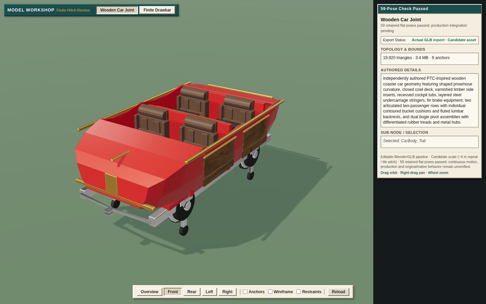

# Finite wooden train joint qualification

The independently authored replacement mounts and 0.20 m drawbar pass the exact
59 retained flat poses. Grok Bot executed the frozen checker with exit 0 and
empty stderr. This removes the measured old-hitch and new-carrier interference
blockers for this fixture. Wooden rides remain unavailable in the playable park.

## Actual result

| Check | Measured result |
|---|---|
| Retained poses | 59 passed; no failed numerical or contact cases |
| Unexempted surface intersections | 0 |
| Closed-solid or ambiguous containment | 0 |
| Maximum running-wheel contact residual | 0.036129 mm |
| Maximum link endpoint closure residual | 1.490122 × 10⁻⁹ m |
| Minimum posed drawbar-to-mount surface clearance | 1.880624 mm |
| Mounting contact | Four bounded stringer patches on each car; 472 applications, zero support-plane/opposed-normal residual |
| Existing car | All 11 mesh fingerprints and 22 named frames retained; only chassis components 7/8 removed |
| New solids | Front/rear mounts 360 triangles each; drawbar 436; closed, outward, manifold, no self-intersection |
| Original 8 m negative control | 30 shell intersection pairs; strict triangle 87/11 crossing retained |

The checker tests actual finite triangles, self-intersection, closed-solid
containment, material/bitmap bindings, physical eye/pin/marker binding and a
continuous material span. Each pose checks 241 mesh pairs. Actual summary
reductions are 46,205 intersection and 45,131,175 distance tests.

The [summary](summary.json), [command](finite-command.txt),
[stdout](finite-stdout.jsonl), [exit](finite-exit.txt) and
[input hashes](finite-input-sha256.txt) identify the executed run. The full
[result](finite-results.json.gz) retains every pose matrix, contact record,
triangle witness and distance measurement. Its decompressed SHA-256 is
`44a67423ea16d317df1b1915afaaf492ff3d28654ad82d72525b591255f89cba`.
[Packaging hashes](packaged-results.json) preserve exact uncompressed bytes.

## Artist and preservation changes

AGY authored the drawbar, clevis/pin mounts and revised Y-shaped carrier. Root
applied those bounded returned source fragments, exported them with Blender
4.3.2 and welded only new hardware with offline exact solid unions. The first
centre carrier physically intersected its own bogie plate in every pose. The
revised carrier reaches both unchanged stringer end faces at X ±0.46 m and
longitudinal ±1.25 m without crossing that moving bogie.

Blender re-export also changed encoded TEXCOORD_0 bindings on ten original
meshes, while POSITION, NORMAL and other layers stayed identical. The final
[composer](../../../prototypes/wooden-hitch/compose-car.mjs) preserves the entire
original BIN prefix and every original accessor, resource and node definition.
It replaces only active chassis indices, removing exactly 216 of 972 triangles,
and appends the actual hardware dependencies. Original image bytes, UVs and
seat/bogie/coupler frames remain intact. The obsolete index bytes stay unused.
The [first rejection](rejected-results.json.gz) remains separately inspectable.

The [composition run](composition-run.json) and
[independent exact-closure proof](composition-routed-positive-new-verifier.json)
passed on Grok. Duplicate unused mesh/accessor controls establish the previous
proof gap and its rejection after repair; see [old execution](composition-old-execution.json)
and [new execution](composition-new-execution.json). The actual car bytes did
not change during that verification repair.

## Frozen identities and rendering

| Artifact | SHA-256 |
|---|---|
| Final car | `7b6ae0f47746d4e8bd624ad2323f7cd20abec214711cbfb4e89329adc687202e` |
| Drawbar | `bd65312ab91197d08d66fd6258e31f31e46b6d529832a0d741fcb729e0fec671` |
| Metadata | `6f2b596f104e959580f715be6e72b9a4697b31e6c8548137dca1d2d14705c1f7` |
| Executed checker | `63245e82459d7314b368c7c042b2eea54bd99b0a6c731f5516eaf991081610d8` |

Source and editable masters remain on WD and Grok Bot; the reproducible
[source package](../../../prototypes/wooden-hitch/README.md) records their paths
and provenance. The [structural report](structural.json) has zero errors and
six generated-tangent warnings: four inherited original warnings and two new
mount warnings. Tangent portability remains unqualified. The car has 19,920
triangles and exceeds its initial small-asset budget.

The actual Three.js inspector loads the exact exported response bytes at unit
scale. Desktop/cardinal/close/open-restraint/wireframe/narrow views, pointer
selection/orbit, reload during loading and repeated disposal are recorded in
[browser evidence](browser.json). Fourteen captures pass with no exceptions or
accumulated GL errors; final repeat reload counts are three geometries and seven
textures. This is software WebGL evidence, not a hardware frame-rate result.

## Review and next boundary

Independent Sol Max reviews closed concrete inventory, bitmap-fingerprint,
nonmanifold/self-intersection, physical binding, outer-rim measurement and
append-dependency proof gaps against actual red/green controls. All
[17 geometry controls](regression-summary.json) pass. The final independent
read-only review recomputed all 59 fixture correspondences, contact applications
and numeric totals from the actual result; see [review record](review.json).

The [frozen pose fixture](frozen-poses.json.gz) keeps a 0.20 m fixed link and
approximately 2.88 m straight root pitch: 2.68 m coupler span plus the link.
This supersedes the earlier direct-coupler 2.68 m production proposal.

The result qualifies exactly these 59 sampled flat poses. It establishes no
continuous swept envelope, safe minimum radius, grades/Z/native occupancy,
station/passenger/roof/support clearance, guide/upstop mechanics, force/fatigue
behavior, original agreement, active mixed-profile gameplay, representative GPU
performance or human visual acceptance. Continue with the
[mixed production plan](../native-asset-calibration/next-production-plan.md)
and keep those gates separate.

## Actual public inspector

The [finite wooden-car/link inspector](https://patrick-fu.github.io/coaster-tycoon-3d/previews/wooden-hitch/)
was published at `fb300e76d47d200404adb045317eb69f5f860ac3` with source
`db0b6a4cb6a5ab23ad8e1228d2c238d968b8018a`.
[All 17 HTTP resources](public-http.json), totaling 6,983,919 bytes, match
the published inspector, vendor modules, composed car and drawbar. The actual
[public browser run](public-browser.json) passes 14 captures, pointer selection,
orbit, narrow layout and repeated loading with no exceptions/GL errors and
unit scale. Its loaded asset response hashes match the final car/link/index.
Subsequent Classic publication preserves every inspector blob. This public
viewer remains a finite experiment; it activates no wooden ride and closes
none of the continuous/native/station/gameplay/original/hardware/human gates.
