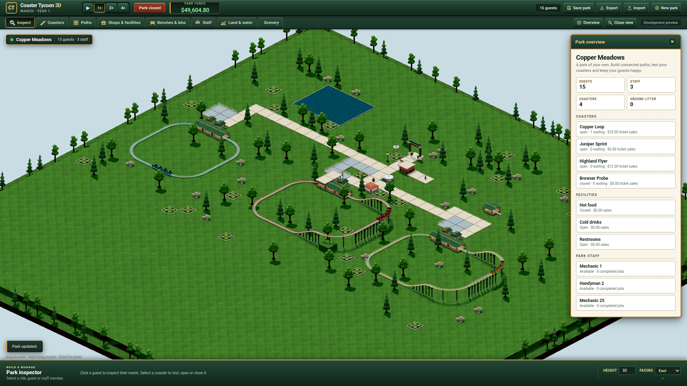

# Content identity foundation verification

This batch implements v8 content/instance identities, exact legacy migration and
versioned worker/presentation contracts. It does not qualify original facility
behavior, full catalogue construction or final art. The
[interface and remaining gates](../../content-identities.md) describe its scope.

All compilation, simulation, tests and browser execution ran on `grok-build`.
The Mac was used only for source editing, Git and retained file inspection.

## Actual execution

- TypeScript 7.0.2 compiled the source; the complete suite passed **121/121**
  tests, including real worker messages. The initial old-kernel check was red
  for the intended absent v8 identities, recorded in `migration-red.log`.
- The actual kernel at baseline commit
  `5571d39bc88b024ecccaa46dbacfa6707099a449` generated two populated v7 saves
  and another 1,200 ticks of continuation. The new kernel imported those bytes
  and produced exactly the same previous persisted fields with split batches.
  `test/fixtures/v7-continuation.json.gz` retains those independently authored
  MIT cases as a repeatable regression; `baseline-comparison.json` records the
  separate-host experiment.
- The browser ran **30 Classic regression checks** plus **three additional
  identity/reload/presentation checks** on Chrome for Testing 155.0.8059.39.
  The actual default profile `/home/box/.config/google-chrome` was reused.
  A real v7 file import produced a real `coaster-park.json` download with v8
  and content v1. IndexedDB reload restored constructed instances; the park
  continued worker ticks, and unsupported presentation rejected before scene
  replacement. Both desktop and 1280×800 captures are retained on WD. No
  browser exception or checked WebGL error occurred. This software-rendered
  Linux run does not qualify the required representative integrated GPU.

`verification.json` records commands, outcomes, counts and log hashes;
`source-inputs.json` records the exact 63 source/test/config inputs compared
against the remote checkout. `catalogue-derivation.json` records the pinned
inventory inputs and reference-only status. Full command logs, downloaded save,
old/new comparison scripts, captures and raw agent streams are retained on WD
under `/Volumes/WD/code/workspaces/coaster-content-identity/evidence`.

## Review and corrections

GPT 6.1 Sol Max independently reviewed the migration, command, lifecycle,
accounting, copied projections and worker changes. It found an old scenery test
fixture that wrongly retained v8 fields while claiming v6, and missing
attribution for the newly distributed reference metadata. Root corrected the
fixture while preserving strict production validation, added the pinned CC BY
metadata notice, and checked the actual distributed notice.

AGY `gemini-3.8-flash-high` completed all eight scoped source reads but initially
timed out with an empty answer. That attempt remains **partial**, despite its
reported SUCCESS and exit 0. A bounded same-conversation resume used the already
read files and completed with a nonempty static review, no timeout or denied
action. Its `commandRevision` blind spot was refuted by `Engine.view()`, which
adds the field to `project()` output. A quoted renderer error string was also
checked against the actual guard. The review did not run or accept art.
`review.json` retains both classifications and root's evidence-based decisions.

The initial full suite was 119/120 until the exact old scenery fixture was
corrected. The first baseline commerce experiment observed the replacement
before the food-wrapper holding period ended; its assertion correctly failed.
The corrected experiment waits through that existing period and requires a
real drink sale. Both diagnostic failures remain in external evidence.

## Remaining programme scope

Reference objects cannot yet be created: no original-indexed construction,
operation or presentation adapter is marked implemented. The candidate
procedural renderer still has its previous `fitModel`/coordinate limitations.
R01–R03 require contrasting geometry, suspended/inverted clearance and ordered
vehicle/dispatch calibration. S05 requires authored scenario recipe, research,
weather and objective state. Native/render coordinate metadata does not close
those cases. The full content, art, operating, commerce, finance, scenario,
original comparison, integrated-GPU and Patrick visual gates remain open.

