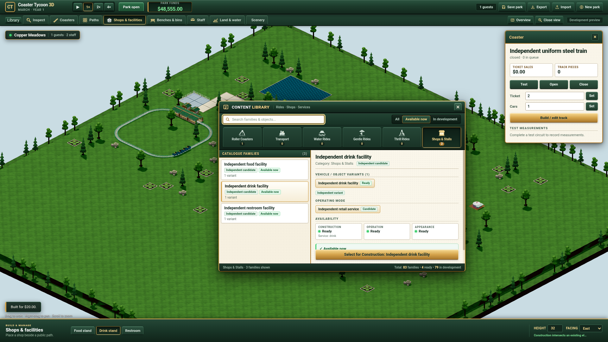

# Classic content library verification

The modeless Classic library reads the real versioned worker catalogue and
selects existing construction tools with their exact content identity. Its six
categories contain 79 original-reference families / 155 variants and four
independent executable candidates. Reference entries expose their variants,
operating modes, sources and development status; they remain unavailable for
construction. This is the first finite frontend batch of issue49, not completion
of the whole catalogue or issue45.

## Actual remote execution

All builds, tests and browser execution ran on Grok Bot. The Mac only edited
source, managed Git and inspected remotely produced evidence. The complete
kernel suite passed **121/121**; its source did not change after that run. A
real Chrome run passed the **30 existing Classic regression checks** and the
first **14 library checks**. Final category/selected-text polish passed **15
library checks**. The final lifecycle check separately exercises provider
failure/retry, markup and unsafe-source handling, unknown adapter tags, and
completion after disposal. Its terminal result is retained separately.

The browser used Chrome for Testing **155.0.8059.39** with the existing default
profile `/home/box/.config/google-chrome`. Real park pointer clicks created a
coaster and drink facility with exact identities and authoritative costs.
Browsing/filtering/cancelling preserved the complete saved park byte for byte;
actual header dragging changed only window position. Keyboard/Space/Escape,
selection focus, scroll preservation, close/reopen, desktop and 1280×800 bounds
were checked. No browser exception was recorded in the passing runs. These
software-renderer checks do not qualify the required representative integrated
GPU or Patrick's visual/play acceptance.

## Failures and root decisions

The initial AGY authoring turn completed with a nonempty report and no denied
action, stderr or timeout. Root integrated its isolated files and corrected
actual source/runtime problems rather than accepting its prose claims.
`review.json` records that boundary and the independent Sol Max review.

`red-browser.json` reproduces two defects before their fixes: immediate
open/destroy produced a deferred `querySelector` exception, and selecting a lower
family reset list scroll from 2,000 to zero. The green/final runs confirm their
correction.

The first polish rerun timed out while awaiting the long browser expression.
The persisted previous test park already contained the drink fixture at
(35,12), so repeating placement could not complete its condition. The corrected
runner starts a real new park and pauses it, records the loaded/reused fixture,
and polls an explicit terminal result/progress instead of one long CDP reply.
The final polish report confirms `reusedFixtureSpot: true` and passes the actual
build assertions. The failed log remains on WD as `polish-timeout.log`; no
production rejection was weakened.

`verification.json` records commands, results and hashes. `source-inputs.json`
contains the exact source/test/config input hashes compared against the remote
checkout. Full logs, run driver, AGY raw streams, the initial captures and final
narrow view remain under
`/Volumes/WD/code/workspaces/coaster-content-library/evidence`.

## Remaining programme scope

The interface adds no new ride physics, product simulation, scenario research,
prices or art resources. Original reference capabilities remain unimplemented;
the four executable candidates retain their earlier rules. Detailed models,
wood/steel/water/fixed operating differences, full shops/staff/finance/scenarios,
original comparison and full Classic management windows remain separate work.

