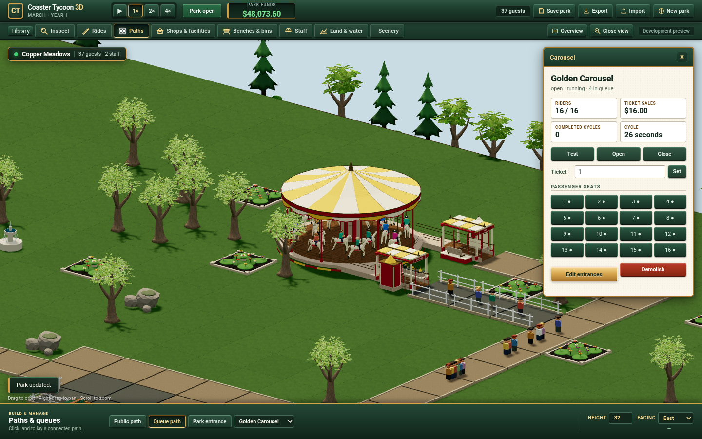

# Independent sixteen-seat Carousel

The new fixed ride operates alongside the existing steel and wooden coasters.
Its body, canopy, sculpted horses, deck extensions, entrance/exit and paid riders
are independently authored. Reference MGR1 remains unavailable: sixteen seats
are metadata evidence; timing, placement, price and maintenance are declared
project candidates in [the slice contract](../../planning/carousel-slice.md).

## Executed evidence

All compilation, simulation, Blender export and Chrome checks ran on Grok Bot.
The Mac only edited and retained source/evidence on WD. The final kernel run
passed148/148 tests; a subsequent protocol-only check passed9/9. Independent
Sol Max source reviews identified finite status/UI/static-budget problems;
Root verified and repaired them. The baseline and failed attempts remain in
`/Volumes/WD/code/workspaces/coaster-carousel` and the isolated asset workspaces.

- Real FIFO admission charges once, fills16 ordered seats, dispatches after
  candidate load waits, runs the indexed80/880/80 two-turn law, returns home
  and unloads once. Closure finishes paid riders; pause/breakdown retain them;
  losing the public exit blocks unload at40 ticks without losing ownership.
- Empty testing-to-open/closed wait reset has an actual failing old-code
  control and repaired cases, including pause/breakdown. An angle-zero running
  session remains uneditable. Inspection and repair use real staff jobs and
  resume saved work across their160/200 boundaries.
- Two Carousel ordered-null patterns and a complete real Train plus Carousel
  duplicate-owner control exercise the combined owner validator. Demolition
  retires income, detaches queues/navigation/jobs and uses a fresh instance
  identity on slot reuse. Construction/terrain/ticket rejection is atomic.
- Frozen pre-change v9 full/null paid parks continue at0/1/17/400/1200 with and
  without fixed profiles:20 exact prior-state/view comparisons. Steel car,
  wooden body/bogie/link poses, RNG, spending and ledgers remain unchanged.
  Historical v7/v8 fixtures, including the1m/1000Hz receiver, also pass.
- Visible fixed bodies survive the8192-static-element budget and partial
  viewport intersections. The actual fixed body is retained before truncation.

The body export has11796 triangles,51 mesh objects, shared horse meshes, explicit
nondegenerate UVs and unit GLB anchors. Actual radial triangle separation from
horses to columns/railings has a minimum0.471784m gap. The two static walk-ins
share the real polygonal deck boundary:1134 actual horizontal-floor probes have
zero failures. The old ideal-circle join fails six probes under the same check.
These bounded body measurements do not qualify rider contact, portals, original
agreement, continuous multi-object physics or representative GPU performance.

[Actual paid browser checks](browser-paid.json) render all16 real guest IDs and
two14-rider null patterns through the shipping Worker. Every authored seat
anchor matches its projected pose within2e-7m; WebGL errors and browser
exceptions are zero. The initial browser attempt passed these three render
cases but failed for the old missing-tip UI exception; it is not counted as a
whole pass. The repaired actual toolbar/queue check and render rerun exited0.
The browser uses the existing remote default profile and SwiftShader.

## Sources and retained failures

Body GLB SHA256:
`405e14e1d2f6a54bd7f05676697f1d96193b7f0378c2426601d0de1484a9464f`.
Editable packed master SHA256:
`9c064e645b140823c77c2d92816b5257ba485c69468471bf4495fa8c070abc72`.
Its retained location is
`/Volumes/WD/code/workspaces/coaster-carousel-model-authoring/evidence/repaired-v5/carousel.blend`.
The [model source](../../../prototypes/detailed-assets/sources/carousel.py),
[measured model data](model-measurements.json), [body probes](body-qualification.json)
and [source pins](source-inputs.json) record the implementation identities.
CC0 inputs are listed in
[material provenance](../../../ui/models/carousel/material-provenance.json).
Original observation pixels are retained outside the repository only.

AGY authored isolated body, rider and portal sources. The first body authoring
turn completed; the repair reading turn timed out with an empty answer, and
the resumed full-module output was truncated/ERROR. Root retained that status,
assembled the inspected source prefix and bounded tail, and accepted only the
actual later Grok outputs. An incomplete export's SyntaxError remains retained.
Raw-v1 geometry/UV failures, v3 residual mane UV failures and v4 floor gaps
remain distinct. Root repaired the measured mane-face UV and actual deck-edge
join. The initial BVH boundary probe produced numerical edge hits; the final
actual horizontal-triangle coverage check retains both old negative and new
passing outputs without ignoring the genuine join gaps.

The [actual Classic browser run](browser-classic.json) passes27 controls and10
Library checks without page errors. [Actual IndexedDB controls](browser-storage.json)
cover v10-to-v9-to-legacy absence-only reads, defined corrupt/null records,
real quiet callbacks, explicit-save recovery and preserved previous slots.
That check shortens the quiet cadence to 500ms and records the actual callback
counts; the inherited JSON scope sentence about suppression applies to the
render smoke only, not these storage controls. The raw report is preserved.
The [final real browser control](browser-final.json) also checks246 actual portal
floor samples and portal bounds, real guest ray picking and seat inspector
selection, hidden-session removal, shared model resources and actual loader
cancellation. These finite checks do not imply full rider/body contact physics.
[Actual public publication](public-publication.md) records the repaired source,
all224 HTTP files and both live16-rider entries. Original
RCT2 metrics, Log Flume, all remaining catalogue/commerce/finance/scenario work,
representative GPU/scale and Patrick's visual/play acceptance remain required.
