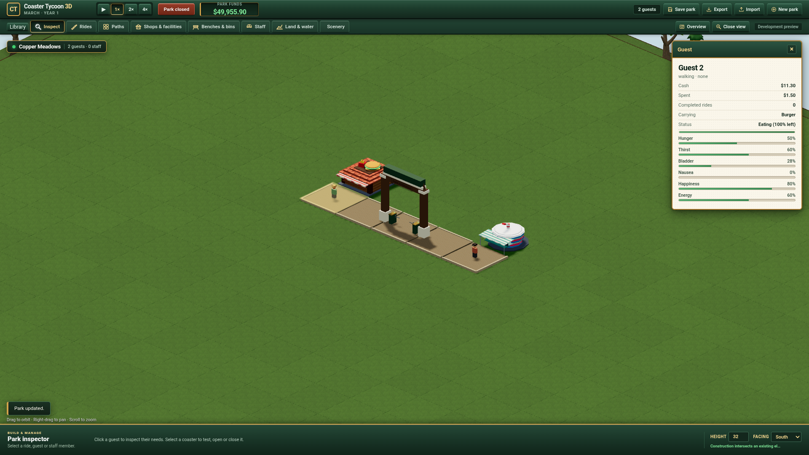

# Finite consumables public delivery

The [Classic public candidate](https://patrick-fu.github.io/coaster-tycoon-3d/?showcase=classic)
and [pinned consumables source](https://patrick-fu.github.io/coaster-tycoon-3d/previews/consumables-fddd5b0/?showcase=classic)
serve immutable source `fddd5b0cccc66164209cdf7d2e543dfb24bb6235`, save12/content5/protocol5.
Build either independent stall through Library → Food or Drinks, connect its
public counter, open it and inspect actual buyers. The five-ride starter is preserved.

## Exact build and distribution

[Committed-source build](publication-build.json) executes only on Grok. All116
authored inputs and154 generated outputs match; removing35 declarations leaves
119 shipping files. Two separately authored provenance records accompany each
route. [Filesystem checks](publication-local-verification.json) verify242 route
files, all812 previous preview files unchanged and the prior empty.nojekyll
hosting marker. Initial Pagesf5fd accidentally removed that marker; the exact
hosting-only repair is524c8a9, with the first staging failure/provider cancellation
retained. Runtime bytes and original previews are unchanged by that repair.

[Matching deployment](https://github.com/patrick-fu/coaster-tycoon-3d/actions/runs/37973293652)
for Pages524c8a9 succeeds. [Actual public HTTP](public-http.json) then verifies all
242 files with first-request HTTP200/exactSHA and zero per-file retries. Deployment
alone is not gameplay acceptance. Node20.19.2/TypeScript7.0.2/build exits/inputs
and every runtime/resource hash are retained separately.

## Actual public player and source proof

[Public report](public-browser-report.md) retains actual r1 terminal0 at18:43:59Z,
root8/pin8 meaningful groups. Each route uses real confirmed New park and existing
five rides, Food/Drink Library choices, park pointers, prices and opening. A declared
empty baseline is generated by the actual deployed Engine with exact receiving
Rules and imported through the real UI; no guest/RNG/Rule or mesh is fabricated.

Two real buyers pay15 and12, transfer27 revenue/8 stock/19 net cash before
separately recorded construction and operating charges. Guest1 owns the drink;
Guest2 owns the Burger. Actual inspectors, pause, exported Blob/file, UI import,
explicit browser Save and manual reload preserve the complete actual checkpoint:
root6502, pin6508. Actual wall-clock timing is retained, not normalized. A crafted
wrapper/product target is rejected by both worker and UI without changing the
complete live state. It is a malformed-input control, not a genuine chooser state.

Each route then exercises real bin deposit, actual checkpoint restoration and
no-bin can/box disposal. Two legal benches move owners through ordinary navigation;
Inspect clears the ghost. Actual.48m macro pixels show the can/tab and separate
kraft base/lid. Final ticks are18153/18205, both cash499529 after490 construction,
zero refunds and no operating charges in these bounded cases. Gross margin does
not imply every park's net profit. All six typed mesh/geometry/material releases
fire once and both meshes are absent after scene disposal; pooled textures remain.

Each route's initial and continuation capture93 parsed source records:372 total
route/phase records, with actual worker Engine71966822/Productb1c and page
Waste6a61 matching readiness. Actual loaded HTML also matches. The earlier local
player/storage/pixels retain their dated Enginef6ad; new public execution bridges
the final validation-only source repair. Only one exact neutral URL is fulfilled
for protected storage; application HTML/modules/assets/worker are real public HTTP.
Only the page's quiet autosave callback is suppressed; no worker clock is changed.

## Independent retention and limits

[Root raw audit](root-public-runtime-audit.json) independently checks all265 files,
55 encoded/decoded records (265,221,362→42,968,920 bytes), complete protected
public-origin database schema/key/value/existence, strict-import equality, real
paid/export/reload state, finances/held/litter, current source bodies/HTML, PNG
hashes, resource events and process absence. [Transport](public-retention.json)
records actual archive/SCP/extraction0 before WD verification; archive70013b11 and
manifestd4a3f77c match. Chrome832077 exits0 and ports8769/9237 are free. Private
full original stored parks and raw CDP remain on WD/Grok; they are not published.

Root's first read-only checker incorrectly demanded pin paidtick6502. Actual
pin6508 has full exact paid/export/reload equality; [failed checker](root-public-audit-failed-r1.json)
and premature missing-receipt SCP failure remain retained. Only that checker
assumption changed; no runtime/data replay or weaker continuation comparison.
The producer's post-run metadata-parser failure also remains explicit.

The finite source/public behavior and both whole-delivery Design/Drift rounds
qualify; source integration remains pending. The
[transport cleanup](publication-transport-cleanup.json) frees234,174,364 redundant
bytes after exact116-input/119-shipping/hash guards; frozen science,masters and
failed attempts remain. Procedural props are mechanical candidates,
not ADR0003 final detailed editable Blender/GLB art. Original numerical/art agreement,
representative GPU/scale, human visual/play acceptance and the full programme remain open.
