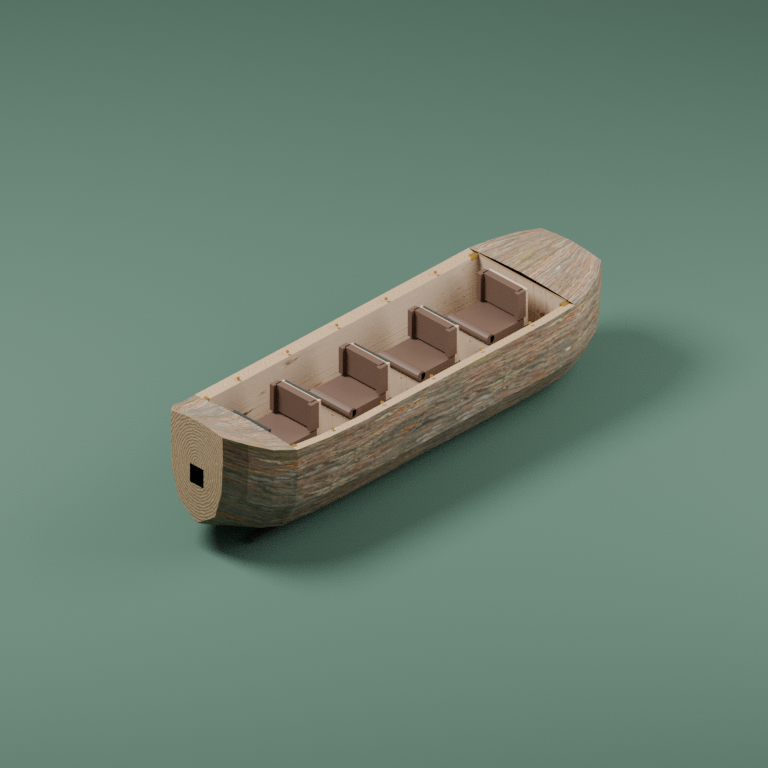

# Isolated four-seat log boat candidate

AGY authored an independent hollow log-boat source and a separate endgrain
node graph. Root executed all Blender, baking, export, structural checks and
renders on Grok Bot. This is a candidate for the planned Log Flume contract;
no boat is shipped or playable and Patrick's visual acceptance remains open.

## Executed qualification

The final v5 run exits 0 with blank stderr. The [measurement report](measurements.json)
has eight meshes/1,916 triangles, nondegenerate geometry/UVs, no inward closed
components, unit transforms and literal four hip anchors within the frozen
metric envelope. These are finite isolated checks, not hull self-intersection,
inter-component separation, rider/channel contacts or continuous physics.

The [material experiment](endgrain-experiment.json) compares every scene-object
geometry/UV/anchor fingerprint with the retained v3 packed master. They are
identical; only cut-end and carved-rim cutwood bindings change. Three actual
512px color/roughness/tangent-normal maps replace the earlier floorboard-looking
cutwood placeholder. Both front/rear views were rendered and inspected by root;
the bounded endgrain improvement is accepted as an isolated candidate.
The raw experiment field named `rangesLinear` is retained; interpret it as
reported image-buffer values, not a verified linear-color-space measurement.

The [actual GLB check](glb-contract.json) independently reads the exported
binary: unit root, four direct ordered hip anchors, UV attributes, six used
materials and nine embedded PNGs. Cutwood binds baked color, packed roughness
and normal maps with metallic factor 0. This does not establish renderer,
loading/disposal, picking, avatar contact, native course or ride operation.

## Sources and retained attempts

Source/masters/raw logs are retained under
`/Volumes/WD/code/workspaces/coaster-log-flume-model-authoring`; remote execution
is under `/workspace/coaster-log-flume-model-authoring` on Grok Bot.

- Boat source `log-boat.py` SHA256:
  `f70bd1816e57c2f68cc42d962a30788d9aa44225f0ef0bd5b96d3f40f7d06927`.
- AGY `endgrain.py` SHA256:
  `8008f33fcdbe624d69d6423daaad0a394bb71a090559408791ae9e7b64c86d25`.
  Its turn is SUCCESS/exit 0 with actual requested/effective model
  `gemini-3.8-flash-high`, three completed reads including both required inputs,
  no reported denied actions and blank stderr. OS write/shell restrictions
  kept authoring answer-only; root ran the returned source separately.
- V5 packed master `evidence/endgrain-v5/log-boat.blend` SHA256:
  `655140c3855deb1c5c7eac94151fc99d653f40cfc479803287b57771750058e3`.
  It retains the editable procedural graph, source text and packed images.
- V5 GLB `evidence/endgrain-v5/log-boat.glb` SHA256:
  `0336a6e7dc4aaa54136193d47187d67d2710ba53c4ccca3f93cf81e9dc693549`.

Materials reuse retained CC0 Bark014/Wood096 sources; endgrain is independently
authored from nodes rather than copied original pixels. Full input texture
hashes are in the measurement report, with source lineage in the existing
[acquired material record](../../planning/materials-acquired.json) and
[detailed asset pipeline](../../../prototypes/detailed-assets/README.md).

Raw-v1 export-helper setup failure, raw-v2 frame/winding failures and repaired
v3 are retained separately. Root rejected v3's rendered cutwood appearance.
Endgrain-v4 baked/exported but then exited 1 because the empty factory scene
had no World; root preserved its wrapper/maps/master/GLB/logs, initialized the
required World and used a fresh v5 output directory. No failed attempt is
counted as a whole pass. V5 and all copied output hashes match the actual
remote reports. The visible dark end rectangles are authored rubber bumpers.

Original agreement, complete art-style approval, game/browser integration,
boat/rider/channel contacts, motion/economics/lifecycle and representative
GPU/scale remain unqualified. Next implement and qualify the
[candidate ride slice](../../planning/log-flume-slice.md).
