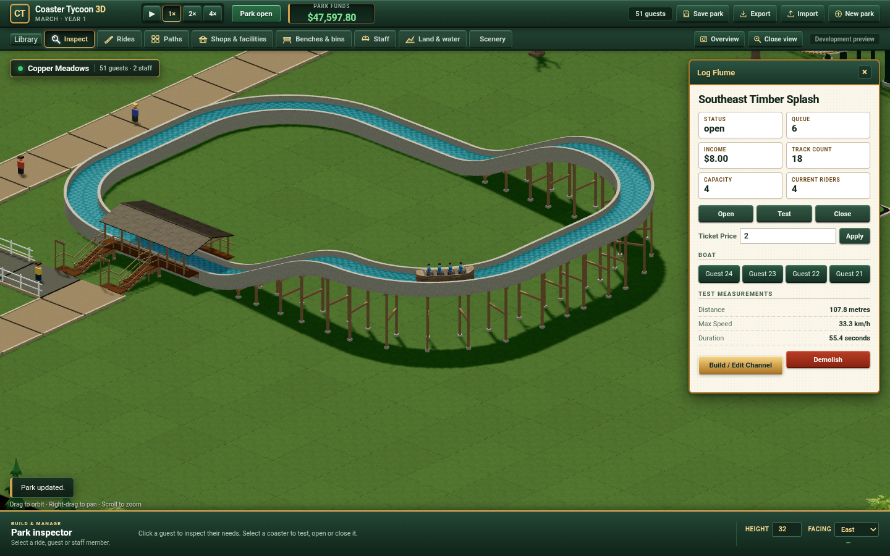

# Finite Log Flume verification

This directory records the independent single-Boat candidate described in the
[slice contract](../../planning/log-flume-slice.md). It is a finite P3 delivery
toward the [complete programme](../../planning/rct2-program.md).

## Delivered boundaries

The browser worker explicitly selects the complete Flume profile at startup
and New park. A new Classic park retains five existing rides and zero Boats;
Library can construct the independent four-seat channel. Zero-argument park
factories and `mixedRules` retain their previous receiving configuration.

The channel supports contiguous station sections, four matching R8 turns,
one lift/drop and at least eight metres of splash channel. The first two
station sections form the loading bay; extended stations retain their entire
course but do not move the first/second entrance/exit or the 6100mm dock.
Boat owners, fares, measured tests, close/pause/breakdown, staff work,
demolition and saved authority use the shared Engine.

The independently authored Boat/Rider models, timber channel, covered station,
side portals and path approach use literal metre frames and real seat owners.
[Resource provenance](../../../ui/models/flume/README.md) identifies exact
exports, editable masters and separately permitted maps. Assets load only when
a supported Flume is present; failed/cancelled loads release their resources.

## Actual checks

- [Kernel](kernel.json): 238/238, exit0, zero skipped tests and blank stderr after both
  long-station and successful Test-intent repairs. The two Test controls prove
  that success retains its witness after4000 extra ticks and exact restore,
  while explicit Test clears it and failed null-witness tests still retry.
  This is candidate policy, not original-game agreement. The three affected
  long-station tests also pass with a16-tick
  observation interval; existing tests retain their default interval. The
  original red10100/14100mm docks and accepted incompatible draft remain raw
  failed evidence. The corrected6100mm return preserves full12/16m courses,
  real second-bay Hip positions, exact reload and atomic draft refusal.
- [Production controls](production-controls.json):15 actual Library/worker/
  Build/inspector/price/switch/Carousel controls, exit0, no runtime/network
  errors and original four browser records exact. The
  [150-file stage](production-stage-inputs.json) used the actual production
  worker with only diagnostic UI exports/quiet-save suppression;
  [source invariance](production-invariance.json) is exact. These controls
  predate the narrow dock and Test-intent repairs; their ordinary construction
  behavior is unchanged. They are not described as a new run of current code.
- [Production storage](production-storage.json):5 actual same-Chrome receiving
  and accelerated production quiet-save controls, exit0. Published v10
  authority migrates after only declared fields; incompatible unpublished v11
  refuses without fallback or overwrite. Matching import reenables saving.
  Original records and tested source restore exactly.
- [Current Classic and Library](classic-library-browser.json):27 and10 real
  controls pass after repairing the existing v7 fixture projection and concrete
  11/4 version expectations. Library distinguishes the available independent
  Flume from its disabled original reference. Three actual canonical verifier
  tail cases also pass: page reload, separate showcase save and returning to
  the unchanged player park. [The tested adapter](classic-library-inputs.json)
  changes only owned HTTP port/evidence directory and reuses the same CDP
  wrapper; direct CLI bootstrap is not claimed. Exit0, blank stderr, zero
  runtime/network errors and the complete original store restored exactly.
  The intended red and intermediate green remain in the WD raw corpus.
- [Actual paid browser](paid-browser.json):7 controls, exit0 and blank stderr,
  with zero page exceptions, console errors and failed requests. The real
  worker completes a successful empty Test, retains the same witness after
  4000 further testing ticks, then accepts normal Open without timing a Pause.
  Four real guests pay20 each and occupy the rendered Boat in order; income80
  is $8. Actual passenger selection/wallet, occupied exact save/restore, close
  retaining seats/pose and all four original stored parks pass. Body-to-public
  position error is zero; literal Hip error is at most5.331205e-8m.
  [Current inputs](paid-stage-inputs.json) pin Engine2b24637b, Native735c2d79
  and worker6736fcb6; [all150 production files](paid-invariance.json) remain
  exact after runtime. UI instrumentation adds diagnostic exports and suppresses
  quiet autosave only; it does not change worker clocks, owners or Rules.
  Earlier failed and pre-intent paid attempts remain in the raw WD corpus.
- [Terrain caller](terrain-caller.md):320 complete buffer/group equivalences,
  536 actual Engine Native checks/442904 triangles/386344 positive partitions,
  five varying-ground R8 contact cases and actual allocation/disposal controls.
  [The summary](terrain-caller-summary.json) consumes passed groups separately
  from the retained overall attempt002 exit1. Painting was bypassed for the
  numeric caller comparison; this proof does not claim identical pixels.
- Separate retained model/composition proof covers literal four-seat fits,
  12 support patches/300 samples, 113792 finite flat combinations and real
  collision controls. Ambiguous ray controls were independently resolved;
  the original failed attempt stays retained. Only byte-proven unchanged
  flat/equal-ground geometry inherits that finite contact evidence.
- Independent Sol Design/Drift and Luna adversarial reviews closed the
  material terrain, asset, UI-switch, long-station and Test-intent findings. Cumulative
  whole-programme closure rounds remain open.

The image comes from the actual paused worker/UI at tick12911, with ordered
owners24/23/22/21; it is not a substitute for Patrick's visual acceptance.

## Recovery and remaining work

[PROGRESS.md](../../../PROGRESS.md) names the active source and exact WD/Grok
raw evidence. All compilation, tests, simulation, Blender and browser work
ran on Grok Bot; Mac activity was editing, file I/O and retained hash checks.

[Authored source inputs](source-inputs.json) identify the finite build inputs;
[all113 match the actual Grok app](source-invariance.json). The initial overly
broad118 list incorrectly included five absent, inactive diagnostic scripts;
its failed record remains retained. This113 record covers actual build:web
dependencies and does not claim those old scripts were executed.
The exact committed release build and public distribution remain separate
checks. Node paid replay is not browser acceptance. Software Chrome rendering does not qualify
representative integrated hardware. Continuous contact/NPC traversal,
exhaustive varied-ground Boat/Rider composition, original numerical agreement,
full catalogue/management breadth and Patrick's visual/play acceptance remain
open. Earlier platform-specific Rules differences are not rounded or silently
admitted; these historical browser checks are explicitly same-Chrome evidence.
