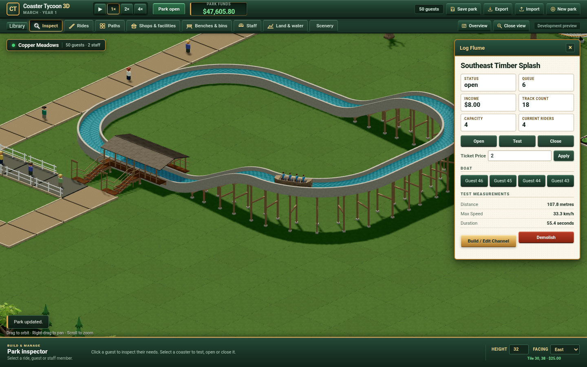
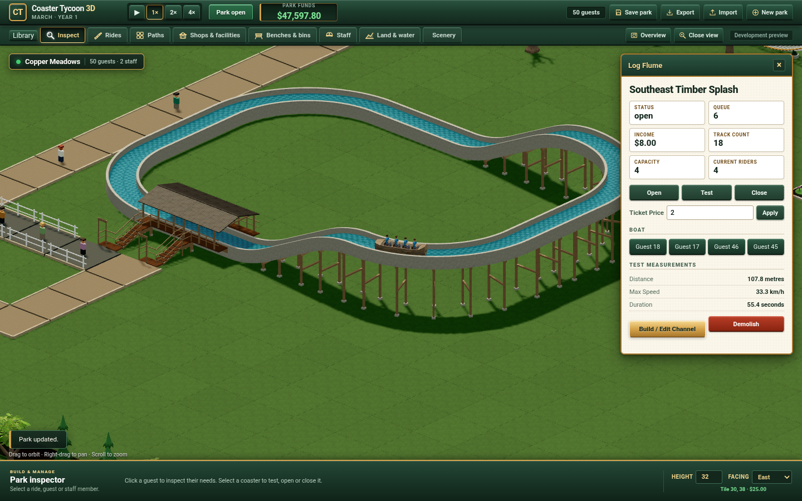

# Public Log Flume candidate delivery

Exact source `89030f9062bf4cff6245722dd8d3846d06d3c83c` is in
[source PR #72](https://github.com/patrick-fu/coaster-tycoon-3d/pull/72).
The current finite candidate uses save 11, content 4 and protocol 4.
A fresh park retains five existing rides and no Boats; construct the independent
Log Flume through **Library → Water rides → Log Flume**. The original LFB1
reference stays unavailable.

- [Current Classic park](https://patrick-fu.github.io/coaster-tycoon-3d/?showcase=classic)
- [Frozen Log Flume source](https://patrick-fu.github.io/coaster-tycoon-3d/previews/log-flume-89030f9/?showcase=classic)

## Exact distribution

The [committed-source build](publication-build.json) ran only on Grok Bot:
113 actual authored inputs, build exit 0 and blank stderr. All 150 built files
match the current qualified production inputs with no missing, extra or differing
files. Removing 34 TypeScript declarations leaves 116 shipping files.

The [filesystem publication check](publication-local-verification.json) verifies
these 116 files plus two explicitly authored provenance records at each route:
236 exact file checks. `build.json` and `preview-manifest.json` identify the
current source and versions; they are publisher records, not build outputs. All
694 historical preview files remain byte-identical to the previous Pages tree.

Pages commit `5ba3a7242d28a3f11ce6078e9eafc69a0888cfd7` passed
[its matching deployment](https://github.com/patrick-fu/coaster-tycoon-3d/actions/runs/37926473000).
The [actual public HTTP check](public-http.json) then fetched all 236 files:
HTTP 200, exact SHA256 and zero per-file retries. No Pages job alone is taken
as file or browser acceptance.

The retained first filesystem staging attempt failed because system Python 3.9
does not accept the newer `tarfile` extraction option. Root restored the owned
Pages tree before corrected filesystem extraction; historical previews stayed
unchanged. A separate publication whitespace check exits 2 at one unchanged
upstream Three.js vendor line. Its exact release hash is preserved; authored
source checks were clean. Both raw results remain in the publication corpus.

## Actual public browser boundary

[Root gameplay](public-root-gameplay.json) covers nine actual groups from
`public-r4`: real New park and explicit receiver, real Water Library/Choose,
18 legal Build actions, successful empty Test with 4,000 additional testing
ticks, normal Open, four ordered paid guests, actual Boat/body/literal Hips,
guest selection/wallet, exact occupied restore, Close retaining owners/pose,
and the original public-origin store. These are nine grouped checks, not a
claim that each listed action is a separate test.

Actual paid state is tick 12,947, owners 46/45/44/43, income 80 tenths ($8).
Body position error is zero; literal Hip error is at most 5.331204e-8 metres.
The two original park records remain byte/value exact before cleanup and after
the later failure. Exceptions, console errors, failed application requests and
WebGL errors are zero; owned Chrome exits 0. Only the 60,000ms window quiet-save
interval is suppressed; Worker clocks, Rules, guests, fares and guards remain.

The overall r4 run still exits **1**: after these gameplay groups, its read-only
source collector selected a cached worker response whose CDP body was unavailable.
A separate root startup source probe then exited **0**, capturing the actual
HTML response and JavaScript module bytes from the owned live page/worker's
parsed scripts. All 12 files match the release SHA256. Root gameplay was not
repeated.

The same owned Chrome/target/session then exercised the **pinned route's nine
application groups** and captured its 12 actual source files. Its paid state is
tick 12,910, ordered owners 18/17/46/45 and income 80 tenths ($8). Body error is
zero and literal Hip error is at most 5.331203e-8 metres. Occupied restore is
exact; real Close retains owners/pose. Both original public-origin park records
remain byte/value exact. Exceptions, console errors, failed application requests,
background protocol errors and WebGL errors are zero; the owned target closes
and Chrome exits 0.

The **whole residual run also remains exit 1**. Its final blanket browser-log
assertion sees one 404 at `https://patrick-fu.github.io/favicon.ico`. The retained
request identifies `Other`/`initiator: other` and the neutral `build.json`
document before application navigation. This browser-generated host-root icon
is outside the game path and the 236-file release manifest. The error is retained
as an optional host-root icon limitation; no application error is ignored.

[Grouped public acceptance](public-browser.json) explicitly consumes root nine,
pin nine and 24 exact full source files while preserving both whole failed runs.
A separate Grok retained-evidence audit exits 0 with blank stderr and checks
real owners/fares/riding state, body/Hips, occupied restore, stored records,
pixel hashes, actual source/session identity and the exact favicon attribution.
This is an audit of retained actual execution, not a new gameplay replay or a
claim that global browser logs were empty. Independent Design and Drift inspect
the same raw evidence before bounded release integration.

Earlier failed public attempts remain retained: r1 selected an octet-stream
LICENSE as its neutral page and downloaded that exact task-owned file; r2 compared
raw Rules with the Engine's normalized receiver; r3 used stale camera matrices
and created the wrong tile. The corrected r4 uses refreshed matrices, actual UI
hover and an immediate actual-anchor guard. Independent read-only Luna diagnosis
consumes r3/r4 and finds no supported production pointer regression.

## Retained scope

Raw build, HTTP, staging and browser attempts are under
`/Volumes/WD/code/workspaces/coaster-log-flume-publication`; corresponding runtime
proof remains under `/workspace/coaster-log-flume-publication` on Grok Bot.
All build/test/simulation/render/browser execution uses Grok; Mac activity is
editing, Git, file I/O, hashing and viewing transferred images.

This finite candidate does not establish original LFB1 values or art, continuous
Boat/Rider or NPC contact, exhaustive varied-ground composition, representative
integrated GPU or full-park scale, complete catalogue/management breadth, or
Patrick's visual/play acceptance. The [full programme](../../planning/rct2-program.md)
and [current execution context](../../../PROGRESS.md) keep those gates explicit.
