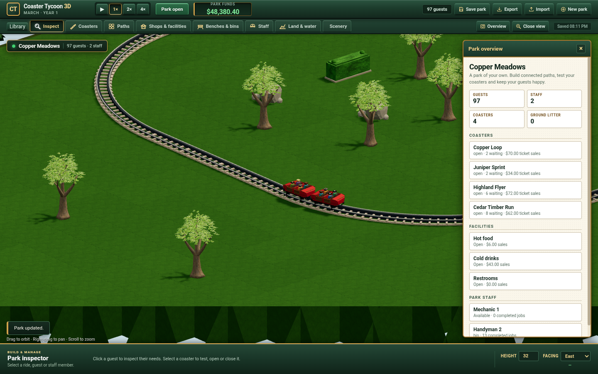

# Mixed detailed wooden and steel coaster verification

This record covers the finite independently authored mixed-coaster slice from
baseline `ffdb8e933e14b5bb6380b8b68d7ddafd8e706d12`. All compilation, simulation,
geometry and browser execution ran on Grok Bot. WD retains source masters and
raw evidence. No Mac build, test, renderer or geometry run was used.

The [operating contract](../../mixed-coasters.md) requires dry, level ground,
flat/R16 track, four ordered wooden seats and at most two cars. The reference
Wooden/PTCT1 entry stays unavailable. This does not finish the full programme,
original agreement, representative integrated-GPU or Patrick's visual/play gate.

## Delivered identities

| Input | SHA-256 |
| --- | --- |
| Final `src/simulation/engine.ts` | `5a03c4062bdbc72f5a5decc29e32d994e31a4541baf76e2c91c7f48f5b9cd175` |
| `src/simulation/wooden-motion.ts` | `583b06d11b7592136ed7198c377d20c73ff628613623fe4a78f90be2debce251` |
| `src/simulation/wooden-placement.ts` | `0209a4c07a298a538c5820f4e68a7e47a1d4b230762a28ea09b66c8faee92973` |
| Final `ui/art/wooden-coaster.js` | `9ebceda15d406332d37ab8dae756a1725b7a36cc7278ab7ac8b6d7438c920898` |
| `ui/art/wooden-assets.js` | `3475acd3d3975ad8951135e0e3382ab7f530b5fa87824ec0013575086522a237` |
| `ui/game.js` / `ui/park-scene.js` | `8823206e25ef7c4a04dd6b6635638423d7b6c5fd44c034d7be0e91125299ab76` / `9aa9fa2e68dbfe7ab035afdd351a2a2c3a7b59bd03801051c929a7e7eb61349f` |
| Car GLB | `ed293d53712c1bc02ce01a5c027d69dd7b31e60ae41c8a811d9a9464274f9adc` |
| Link GLB | `bd65312ab91197d08d66fd6258e31f31e46b6d529832a0d741fcb729e0fec671` |
| Station GLB | `32214cdb6f388bcda1bdbbd59b8ac5a59ba454d947d2fde45380898572809cbd` |

`source-inputs.json` records the final source snapshot. Earlier records retain
their own hashes; later admission restrictions do not relabel earlier execution.
Geometry, model datums and preserved material bytes did not change when the
final ground/water and picking predicates were repaired.

## Executed checks and boundaries

| Check | Actual result and scope |
| --- | --- |
| Compilation and full simulation suite | Final remote `npm run build:web` and `node --test test/*.test.mjs`: 131/131, exit0. Includes actual historical v8 continuation, populated migration, mixed paid operation, ordered holes, profile validation, four-direction placement and ground/water rejection. |
| Historical steel continuation | Frozen prior-kernel traces in [v8 continuation](../v8-continuation/README.md), including nondefault steel and legal 1 m/1000 Hz receiving rules. Existing steel numeric rules and trajectories remain intact under matching declared receivers. |
| Old elevated-foundation negative | Actual old Engine accepts ground paths through unreserved elevated timber foundations. Final candidate rejects elevated station construction and that unpublished saved geometry atomically. Ground lowering and equal-height water are separately rejected before quote/execute/load mutation. |
| Generated track batching | 24 flat/left/right × four-direction × ground/elevated authoring cases preserve ordered indexed triangles, normals and metre UVs; maximum Float32 position difference `3.815e-6 m`, UV difference zero. Elevated authoring correspondence does not enable elevated production construction. |
| Imported car preservation | Independent parser confirms original GLB BIN prefix, attributes, UVs, resources, material bindings and node transforms; only four specified old brackets removed and new leaves appended. Four real corruption controls reject. See [preservation report](preservation-report.md). |
| Finite car/rail contact | Actual new straight surfaces, affected 59 flat/R16 relative hardware poses and drawbar bounds. Original world-space SAT witness reconstruction failure remains raw; common-bogie rigid-frame adjudication and affected supplements have their own exit0. See [contact report](contact-report.md). No universal swept-solid or manufacturing claim. |
| Generated portals | All16 actual mounts: 560 meshes, 26,752 vertices, 256 complete cylinder envelopes, complete .60 m ingress floor bands, real barriers and native cells. Four valid far mounts save/restore; actual unrelated approach conflict rejects in both placement/save orders. Old disconnected floor and omitted-ingress-bounds negatives reject. See [portal report](portals-report.md). |
| Actual mixed browser | Four real rides, two wooden cars and one link; actual eight paid guests, ordered intermediate empty seats, max-two-car inspector, real picking, export/import and IndexedDB reload. Every fetched car/link/station GLB matches retained bytes. Functional portion is retained in [the raw partial run](browser-functional-partial.json), whose later camera driver assertion failed; it is not marked a full pass. |
| Cross-save picking | Two actual Engine-built parks reuse car IDs `[1,2]` with wooden ride0 versus ride1. Old factory retains wrong selection0; repaired cached wrappers/link all select1, and real Scene.pick selects1. |
| Resource ownership | [Actual browser controls](browser-lifetime.json) use the unchanged final loader: successful load, failed sibling plus delayed successful mesh, cancel-before-ready, final disposal and refresh-after-disposal. Old late-owner negative retains geometry/material/textures; repaired controls retain zero geometries/materials/textures/bitmaps and no active cars/links. |
| Browser storage and camera | [Affected real-page rerun](browser-storage.json), exit0: absent v9 key falls back and retains legacy; invalid existing v9 key is not bypassed/overwritten by real quiet callbacks; explicit save re-enables saving. Guard-removed built-file negative really overwrites invalid record. Confirmed New park consumes current packet for overview; ordinary refresh preserves orbit. |
| Classic and Library regression | [Actual final checks](browser-classic-library.json), exit0: 27 Classic interaction cases plus exact reload, separate showcase save and unchanged player return (30 total); ten real modeless Library cases, including current two-coaster availability, disabled155 references and actual selected steel/drink construction. The27 completed cases are reused from their successful product portion; only the failed driver continuation was repeated. |

Browser execution used Chrome155, its existing default profile and SwiftShader
on Grok Bot. Storage controls shorten only the quiet-save interval from60000 to
1000 ms; all other timers and authoritative clock/rules remain unchanged. The
temporary red game file is restored in `finally`, alongside the original test
records. Storage-only render loops are stopped; those controls are not screenshot
or performance evidence.

The readable train image uses the complete real Engine-advanced park at tick10166
with matching saved Rules, SHA `3eb77fc61e7a1fb86ae34f028bbc6fd64306f117c7240be2e3bdf215f4d859b0`.
The worker sends its body/bogie/link frames; no renderer pose is invented.
The broad train fixture and actual running checkpoint are distinct from the
older inspector's frozen59-pose input.

## Failed attempts retained

- The first append/load implementation copied a growing element map per record;
  the full capacity test exposed quadratic work. A single validated topology
  overlay now preserves source-order and atomicity without repeated copying.
- The actual GLTFLoader first renamed required car nodes after mesh dependencies
  were eagerly preloaded. Ownership now hooks `loadMesh` in normal parser order.
  Failure/cancel after late completion remains covered by a real old negative.
- Initial transport included macOS AppleDouble metadata, which Node tried to
  execute as a test file. Task-owned metadata was removed remotely; raw failed
  output is retained. It was not a simulation failure.
- Initial ground-only code incorrectly compared roof-layer `cell.low` to terrain.
  Five wooden checks failed. The corrected predicate compares track origin to
  every reserved terrain cell; the ground and final dry suites passed.
- The final mixed driver called overview before its current scene packet arrived.
  Its raw exit1 is retained. The affected control now applies the actual current
  worker packet before judging the camera. Camera-only `1e-8` float correspondence
  does not change geometry/native tolerances.
- The Classic product checks all passed, then the host driver used `__game` after
  navigation cleared its own injected global. The raw ReferenceError is retained;
  reload/library checks now import the current page module explicitly. The27
  already-passed product cases were not replayed.
- Portal raw exit1 contains mistaken portal-only rejection and incomplete-ledger
  fixture premises. The separate actual-approach and ledger-complete supplement
  rejects specifically for clearance. Side-post statistical misclassification is
  also preserved; no geometry predicate was relaxed.

Compressed originals and their source hashes are listed in
`retained-inputs.json`; WD retains the complete model, mesh and runner corpus.

## Independent review and remaining work

Existing GPT6.1 Sol Max sessions completed independent Design and Drift lenses,
two rounds each, over the cumulative delivery. Root verified and repaired
cross-save picking, missing elevated support reservation, stale browser version
fixtures and the equal-height water boundary. The dry-ground contract is explicit;
there is no blanket same-ride or arbitrary path exception.

AGY authored the scoped renderer, mesh concatenation and extended portal landing,
then read all three actual screenshots for a fresh visual critique. Root accepts
the remaining density, detailed stall/steel-car and foliage/queue styling work.
Some critique premises are inaccurate: existing paving/lawn textures are already
loaded and verified, and the station already has platform rails and gates. Those
are not treated as missing implementation or a reason to replace fixed geometry.
The [raw critique](agy-final-visual-critique.md) is retained separately from its
disposition; it does not accept style for Patrick.

Default Rules still generate curve samples with runtime trigonometric functions.
Node/Chrome differ at16 coordinate leaves by at most `1.421e-14`; exact Rules
matching correctly rejects the mismatch. Same-runtime continuation is qualified,
not portable defaults or byte-identical cross-runtime trajectories. Versioned
storage and failed-restore protection do not round or discard numeric fields.

Full visual boarding/traversal, dynamic station gates, elevated foundations,
grades/banks, general mixed turns, water/fixed/transport rides, all products/staff,
admission/calendar/research/scenarios and qualified presets remain programme work.
Original comparison, scale/soak, representative GPU and human acceptance stay open.
