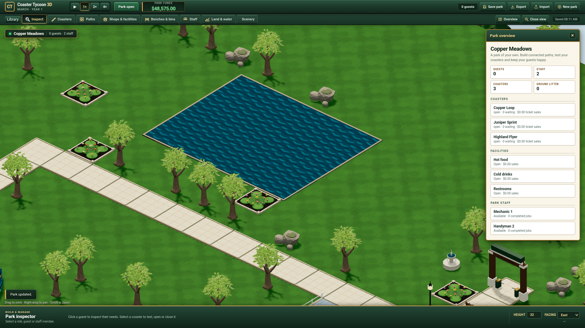
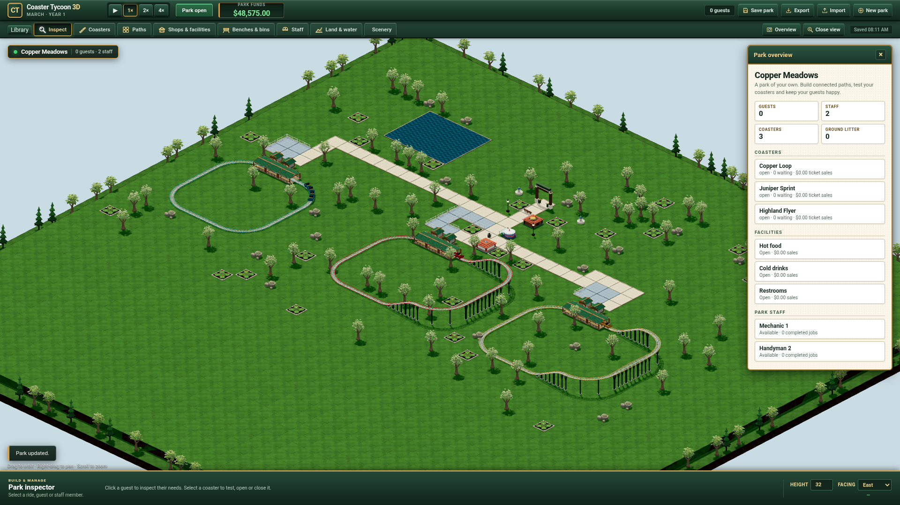

# Detailed oak integration evidence

This finite delivery replaces planted deciduous trees and deciduous perimeter
trees with independently authored textured oak models. It does not implement
new rides, services or original-game behavior. The separate
[editable source](../../../prototypes/organic-tree/README.md) and
[export manifest](../../../ui/models/trees/export-manifest.json) retain the
authoring and delivery boundary.

## Actual execution

All builds, tests, Blender exports, material processing and browser execution
ran on Grok Bot. The Mac edited source, orchestrated SSH/Git, retained evidence
on WD and viewed remotely generated captures. The unchanged simulation suite
passed **121/121**. The final runtime passed **30 Classic checks**, including
real IndexedDB reload and separate showcase-save isolation, and **14 oak
integration/failure checks**. Terminal reports are retained here.

The real browser was Chrome for Testing **155.0.8059.39**, with the existing
default profile `/home/box/.config/google-chrome`, using software WebGL. Checks
used actual worker quotes and construction commands, all transformed model
vertices in four cardinal placements, existing tree price 60 and half refunds,
version 8 save/load, instanced IDs and a native Chrome pointer selecting the
correct tree. Mesh cloning and batching preserve the real alpha-mask shadow
materials. No browser exception or accumulated WebGL error was observed.

Actual zoom selects all three LODs with hysteresis. Every tested replacement
preserves mesh identity, exact instance-matrix data and selection IDs. Perimeter
trees remain LOD2; planted vertices remain inside their existing reservations
at every level. Repeated switches preserve the paused saved park and warmed
renderer resource counts. The retained three LODs have **5,392 / 1,633 / 659**
triangles. Structural validation reports zero errors and zero warnings, with
zero coordinate residual between each inspected GLB and separate runtime glTF.
Every external image byte hash matches its inspected GLB image.

Actual network faults blocked the leaf atlas and binary buffers separately.
Detailed loading remained unavailable and closed **12/12** and **15/15**
allocated image bitmaps respectively. Disposal during actual loading closed
**15/15** late bitmaps without installing a model. These tests exercise the
private asset owner; the ordinary scene retains its existing procedural fallback
while detailed assets are unavailable.

## Measured correction

The first zoom driver exceeded its old 24-second wait while the software
renderer was still advancing through repeated transitions. Its failed record
is retained as `lod-browser-timeout.json`. The revised driver records progress
and waits for an explicit terminal result; no production assertion was removed.

The passing initial implementation rebuilt the whole static park at each LOD
transition. Its measured CPU durations were **117.5–266.9 ms**. Root replaced
that operation with exchanges of only the planted tree geometry, material and
owned depth-material references. The final comparable test observed **zero
whole-park rebuilds** and **0.1–1.2 ms** CPU exchange durations across 15 changes.
This is a finite operation measurement on the remote host, not representative
GPU FPS. The two-frame software-renderer waits remain separately labelled.

`full-static-lod-baseline.json` retains the actual earlier measurement.
`oak-browser.json` retains the final checks, frame triangle counts, resource
counts, CPU durations, native pointer selection and real fault results. Camera
frustum and shadow passes affect frame triangle counts, so they are not an
isolated same-frustum GPU benchmark. Stable 105-pixel hysteresis-band samples
retain different selected levels as intended.

## Authoring and review

AGY `gemini-3.8-flash-high` authored the oak in isolated bounded visual tasks.
Root integrated the actual output, corrected card indexing/winding, required
both leaf tint primitives, and triangulated branch caps before tangent export.
The final source and exporter hashes are recorded in the manifest. The dense
model viewer passed 19 actual captures, orbit/picking, narrow layout and
reload/disposal checks; its report remains separate from playable-park checks.

The AGY crown task initially timed out with an empty response. Root retained its
partial evidence, reduced the task to two function fragments, and verified a
resumed nonempty terminal result and actual exit before integration. Independent
Sol Max review found and root fixed lost clone depth materials, swallowed texture
failures, unowned bitmaps after failed parsing and a missing provisional LOD1.
The final in-place LOD review found no confirmed P1/P2; root added its requested
per-LOD identity, boundary and vertex checks. `review.json` records this scope.
A separate AGY review against supplied installed Three.js sources also found no
confirmed P1/P2. Its first turn was incomplete after a headless URL-read denial;
the second timed out after file reads. The third returned a nonempty verdict
with actual exit zero and no denial or stderr. `agy-lod-review.json` retains
that classification; no permission broadening was used.

The actual raw logs, CLI streams, drivers, rejected iterations, original CC0
bundles and packed editable masters remain on WD under
`/Volumes/WD/code/workspaces/coaster-organic-tree` and
`/Volumes/WD/code/workspaces/coaster-oak-integration/evidence`.
`retained-masters.json` records the checked retained master archive. The runtime
ships eleven resources sharing five published PNGs, **5,325,346 bytes** total.
It does not claim GPU texture deduplication across private LOD loads.

## Remaining gates

Patrick's overall visual acceptance, original RCT2 comparison, original-scale
soak and representative integrated-GPU qualification remain open. Native-pointer
evidence targets the trunk and correct instance identity; alpha-hole ray picking
has not been qualified. The broader ride/shop/service/scenario programme and
wooden-car native integration remain separate work. No original commercial
graphics or GPL implementation are shipped.

## Published follow-up

The source-pinned [Classic oak preview](https://patrick-fu.github.io/coaster-tycoon-3d/previews/classic-98939b7/?showcase=classic)
and [regular Classic preview](https://patrick-fu.github.io/coaster-tycoon-3d/?showcase=classic)
serve runtime source `98939b740c566b529bb4dae17402ce1324ad5717` from PR53.
Pages reported `built` for exact publication commit
`14d66b8aeaaad26184e25c646c6b707361c8c7c0`, without an error. Actual public
HTTP checks compared **154 files / 16,647,230 bytes** against local manifests,
including all models, binary buffers, shared images and addon dependencies.
All **15 public browser checks** passed with actual zoom, instance invariants,
pointer inspection, loading faults and regular-page Library/tree readiness.
Both pages retain version 8 saves. No exception or accumulated WebGL error was
observed. All 189 pre-existing preview files, including the Model Workshop,
were preserved byte for byte. `publication.json`, `public-http.json` and
`public-browser.json` retain the exact evidence; raw driver/logs and public
captures remain in the external evidence workspace.
