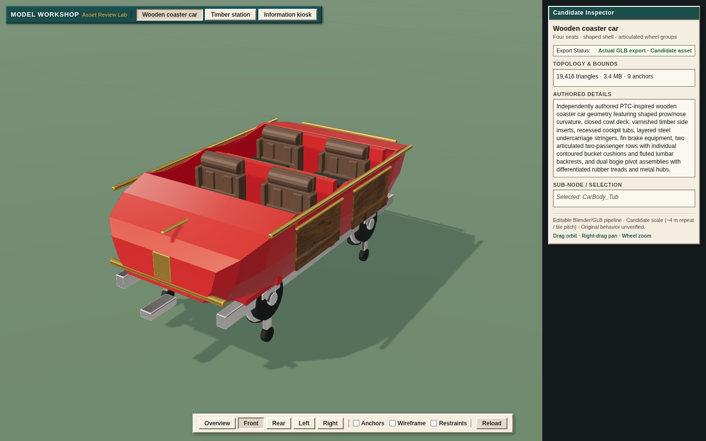
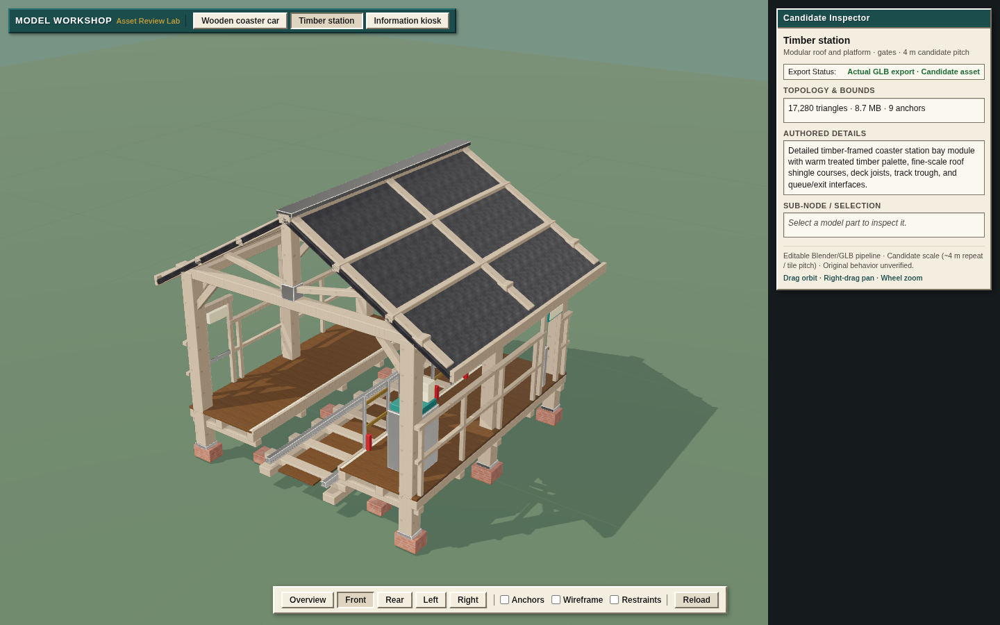
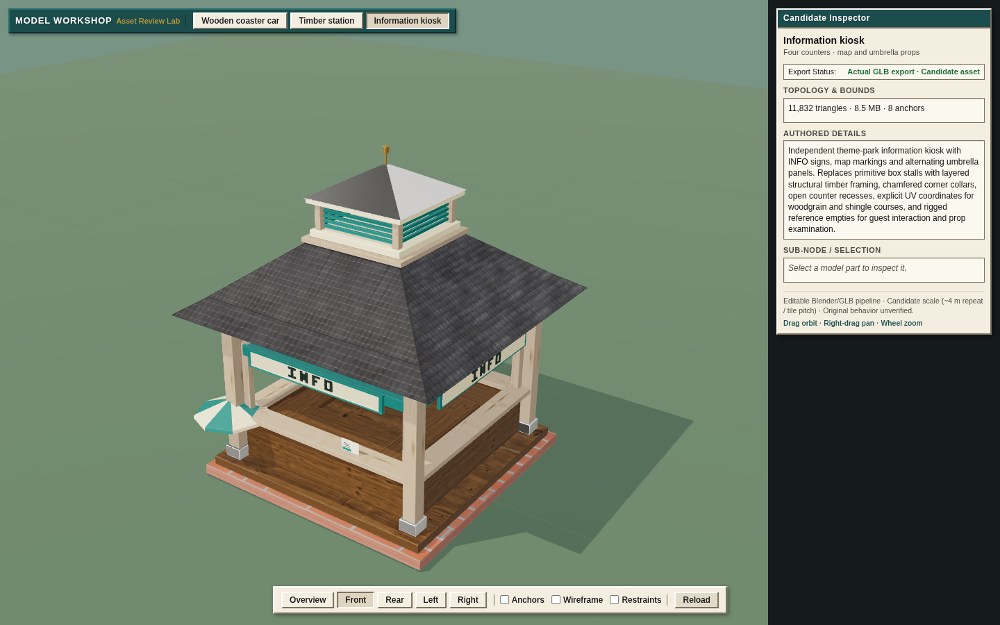
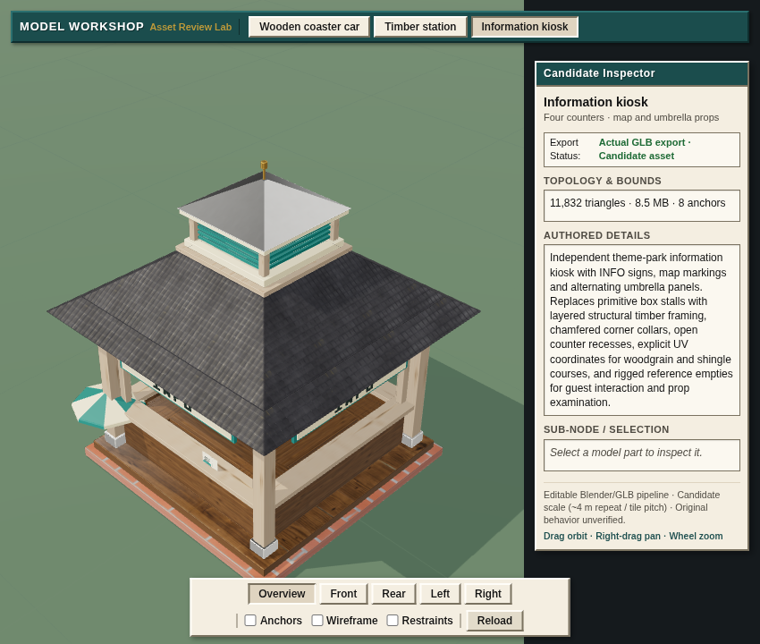

# Detailed model verification

Measured on Grok Bot on **2026-10-08**. No Mac build, test, Blender or browser
execution was used. Host-side file/hash correspondence and image inspection
do not execute the model or game.

| Candidate | Evaluated triangles | GLB bytes | Exported mesh nodes | Anchor nodes | Validator errors / warnings |
|---|---:|---:|---:|---:|---:|
| Wooden car | 19,416 | 3,545,440 | 11 | 9 | 0 / 4 |
| Timber station | 17,280 | 9,141,736 | 9 | 9 | 0 / 5 |
| Information kiosk | 11,832 | 8,950,308 | 38 | 8 | 0 / 14 |

Blender **4.3.2**, Three.js **0.186.1**, glTF-Validator **2.0.0-dev.3.10**,
Chrome for Testing **155.0.8059.39**, Debian 13/software WebGL. Every validator
warning is `MESH_PRIMITIVE_GENERATED_TANGENT_SPACE`: normal-mapped meshes use
renderer-generated tangents. These reviewed warnings remain explicit; this is
not a claim of universal zero-warning output or exact original surface shading.

[Source hashes and stage exits](final-run.json) bind the 10 executed/copied
authoring/export/viewer/check sources. The three asset reports bind the source,
export driver, geometry, raw maps, editable master and GLB. All source PNG
hashes match the acquired licensed corpus; see [material inputs](material-inputs.json).
The independently inspected GLB images are 512×512; editable packed masters
retain the 1K source maps. The actual `.blend` files are retained on WD at
`/Volumes/WD/code/workspaces/coaster-detailed-assets/evidence/masters/`, outside
Git. Their recorded sizes and hashes were checked against those files.

The [delivery manifest](output-manifest.json) records **16 files / 24,016,761
bytes**, including local vendor modules/licence and the three binaries. The
packager walks the actual relative addon dependency closure. It omits the Node
validator from the browser delivery.

The [published Model Workshop](https://patrick-fu.github.io/coaster-tycoon-3d/previews/model-workshop/)
was separately checked from Grok Bot. [HTTP results](public-http.json) match all
16 served runtime files to the same source-pinned manifest; [public browser
results](public-browser.json) repeat the 19 captures and interaction/lifecycle
checks with zero cumulative GL errors and 19 kiosk textures after reload. The
[retained public screenshot](public-kiosk.png) matches that report. Other public
captures are retained externally with their recorded hashes.

The Pages commit is `d2b9f72536a30bdc66ee35842d82f470a4cdc6b2`, with source
`e17c646bc2d49781bd567054309d6c2096bd847c`. The Pages whitespace check reported
nine indentation warnings in untouched upstream Three.js files. Their exact
vendor bytes are preserved and hash-checked; project-source whitespace passed.
The first source push received a GitHub server error; remote refs/PR state were
checked before a controlled retry succeeded. No duplicate PR was created.

## Actual browser checks

[Browser result](browser.json): **passed**, 19 captures, no runtime exceptions,
zero cumulative GL errors, one task page, identity scale on all three assets.
The existing default Chrome profile was used and task-owned processes closed.

The checks exercise real pointer selection and orbit, front/rear/left/right
camera presets, overview and a wheel-zoomed car close view. Screenshots also
cover opened lap bars/anchor markers, kiosk wireframe and an **850×720** window.
All asset buttons stay visible and the inspector does not cover the canvas at
that measured width. Every retained PNG matches its browser-result SHA-256.

The initial-load Reload trigger is checked with deliberately slow network
delivery. Three immediate reload clicks and a subsequent reload leave the
kiosk at **40 geometries / 19 textures**, stable across the two final snapshots:
38 mesh geometries plus floor/grid, 15 embedded model images plus four fixed
renderer textures. The earlier falsely reassuring stable count was 20, because
a retired station texture was still referenced by a shared shadow uniform.

The initial-load dead end was reproduced before fixing requested-entry
ownership. Then explicit bitmap closing exposed a second defect: a closed
station image was re-uploaded as 0×0 by the shadow pass. The
[failure trace](shadow-lifetime-red.json) identifies bitmap 13 and the actual
upload stack. Independent source and image-ID analysis excluded cross-parser
bitmap sharing. Asset-owned depth material lifetime resolves the retained
sampler and preserves actual bitmap closing; final cumulative error capture
does not silently consume transient errors.

## Representative views

## Limits and decisions

The same-source [static grouping ablation](batch-ablation.json) changes 148
station mesh nodes to 9 while preserving 15,984 triangles and all nine anchors.
Later station style edits give the current 17,280 triangles; do not compare
those two different sources as an isolated batching experiment.

The car and station exceed the initial 5–12k / 6–15k triangle ceilings. Current
models need production LOD/atlas/instancing and scene-scale profiling before
bulk rollout. The car's seats and shell remain stylized; timber tone, signage,
original proportions and actual park-zoom readability need visual review.

Opening a hinge in these captures is not proof of passenger or mechanical
clearance. Anchor conversion, four seats and a 4 m station socket separation
are checked candidate contracts; original dimensional mapping is unobserved.
No original runtime/scenario, new production ride, full catalogue, representative
GPU performance or Patrick visual acceptance is established by these checks.
